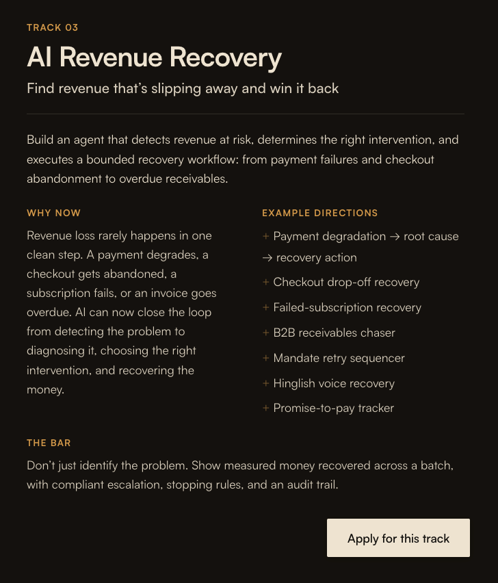

# AI Revenue Recovery - Problem Statement

**Track 3 · Razorpay AI Buildathon 2026**

## The track brief

> Build an agent that detects revenue at risk, determines the right intervention, and executes a bounded recovery workflow - from payment failures and checkout abandonment to overdue receivables.

**The bar:** Don't just identify the problem. Show measured money recovered across a batch, with compliant escalation, stopping rules, and an audit trail.

## Chosen scope

Revenue leakage happens at several distinct points in a merchant's funnel, each with different signals and different fixes:

1. **Payment failures (transaction-level)** - a customer attempts to pay and it fails (bank timeout, insufficient funds, OTP timeout, card declined). _Razorpay sends webhooks for this._
2. **Checkout abandonment (funnel-level)** - a customer never attempts payment at all. _Razorpay has no visibility into this - it happens entirely on the merchant's own frontend, before Razorpay is ever called._
3. **Subscription/mandate failures (recurring-level)** - a recurring payment fails silently in the background.
4. **B2B receivables (invoice-level)** - an overdue invoice needs escalating reminders.

**We are building option 1 only: payment-failure detection → root-cause classification → recovery action → outcome tracking, driven entirely by Razorpay webhooks and nothing else.**

Checkout abandonment was explicitly considered and dropped for this build, because it has no Razorpay webhook to react to - including it would require a synthetic, non-Razorpay event source, which breaks the "webhooks-only, fully reactive" design constraint we chose. Subscription/mandate and B2B receivables are out of scope for the initial build but the architecture is designed to let them plug in later as additional event sources feeding the same pipeline.

## Why this problem is harder than it looks

- **Different failures need different fixes.** "Insufficient funds" needs a delayed retry, not an immediate one. "OTP timeout" needs an instant fresh payment link - the purchase intent was real. "Card declined" might need a different payment method suggested entirely, not a retry at all. A single blanket "retry the payment" rule is naive and will underperform.
- **Recovery attempts are not free.** Every SMS, call, or retry has a real cost (money, customer annoyance, regulatory risk under DND/NPCI mandate-retry rules). Retrying blindly can cost more than it recovers, or get a merchant flagged for spam.
- **Naive success measurement is misleading.** If a customer fails, gets a recovery nudge, and pays two days later, did the nudge cause that, or would they have paid anyway? Counting "recoveries" without a control/counterfactual comparison overstates impact - and Razorpay explicitly wants "measured money recovered," not a cherry-picked success story.
- **Bursty, unreliable delivery.** Webhooks can arrive out of order, be delivered more than once, or spike suddenly (e.g. a bank-side outage causing a flood of failures that shouldn't each be retried individually).

## What "done" looks like

An agent system that:

1. Reacts only to Razorpay (test-mode) webhook events - no manual triggers, no chat interface as the primary input.
2. Classifies the root cause of each payment failure.
3. Decides whether a recovery action is economically justified, and which one, using an explicit, inspectable policy - not a black box.
4. Executes the action through a bounded, policy-gated pipeline with retry caps and stopping rules.
5. Tracks whether recovery actually happened, and reports **incremental** money recovered across a batch (not just gross recoveries) - with an honest accounting of failures it could not resolve.
6. Produces a full audit trail: every decision, why it was made, and what policy gated it.

## Why this differentiates from a typical entry

Most entrants will build a single-shot "detect failure → send retry" demo and report raw recovery counts. Our approach is deliberately more rigorous:

- **Counterfactual measurement** - a held-out control slice of failures gets no intervention, so recovered revenue is measured incrementally against that baseline, not just as a raw success count.
- **Cost-aware decisioning** - every action is gated by an expected-value check (`recovery probability × transaction value − action cost − annoyance/compliance cost`), so stopping rules are economically justified rather than arbitrary retry caps.
- **Explainability as a first-class artifact** - every decision produces a human-readable causal trail, not just a log line.
- **Production-mindedness** - the pipeline is explicitly tested against duplicate webhook deliveries, out-of-order events, and failure-rate spikes (potential bank-side outages), rather than only a clean happy-path demo.
